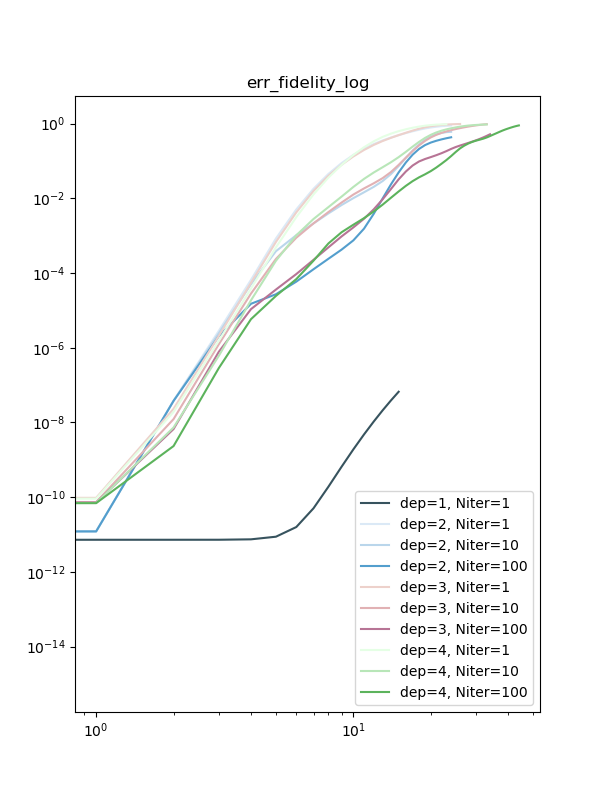

# qTEBD

qTEBD is the algorithm for real or imaginary time evolution by fidelity maximization. We benchmark such algorithm on MPS for ground state search and quench problem. Then, we show that the algorithm can be generalized to classical simulation of quantum circuit.

### Requirement

numpy, jax, (TeNPy)

## qTEBD for Ground state with MPS and Quantum Circuit

See directory "1 ground state"

## Quantum Quench
### TFI L = 31, g = 1.
MPS       |  Circuit
:---------------------------:|:-------------------------:

## fidelity

### Single-layer circuit

Single-layer circuit should match with the result of qTEBD with MPS and DMRG with MPS of bond dimension 2. Indeed we see that. Optimization for single-layer circuit is benign and could be easily solved with one iteration/sweep per time step.

### n-layer circuit

* There are different way to optimize n-layer circuit. Here we consider to randomly initialize n-layer and optimize Niter time per time step.
* With near identity initialization and change Hamiltonian basis.

