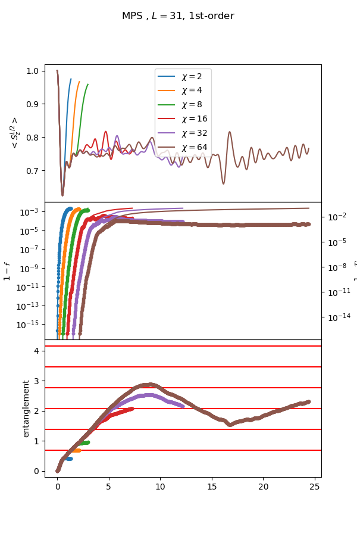

## Usage

```bash
python run_optimization_cat_brickwall.py --L 4 --depth 3 --N_iter 2
```

### Explanation
The file `run_optimization_cat_brickwall.py` is similar to all other `run_*.py` files.
They all have similar structures that they take some input parameters, target state and circuit layout setup
and run the optimization.
They have slight differences in the setup.

One starting point is to see how one could represent the GHZ state with brickwall type circuit.
* You could directly run the command above and see the result.
* You could adjust the system size L, depth, and number of iteration in optimization process.
* You should be able to see that one need at least depth=L-1 to represent the GHZ state.
* You should also see that one might get stuck in the optimization process. Compare the two following command.
  `python run_optimization_cat_brickwall.py --L 7 --depth 6 --N_iter 10`
  and
  `python run_optimization_cat_brickwall.py --L 8 --depth 7 --N_iter 10`  
  you should see the differences.


## Ising model with g=1.0, h=0.

H = - XX - g Z - h X

### Circuit approximating chi=128


### MPS approximating chi=128


### MPS tebd result


## Ising model with g=1.4, h=0.9045
### Circuit approximating chi=32


### MPS approximating chi=128


### MPS tebd result


## Comparison

g=1.0, h=0.0       | g=1.4, h=0.0
:---------------------------:|:-------------------------:
Circuit approximating chi=32       | Circuit approximating chi=32
    |  
MPS tebd result  |  MPS tebd result
  |  


g=1.4, h=0.1       | g=1.4, h=0.5
:---------------------------:|:-------------------------:
Circuit approximating chi=32       | Circuit approximating chi=32
    |  
MPS tebd result  |  MPS tebd result
  |  

