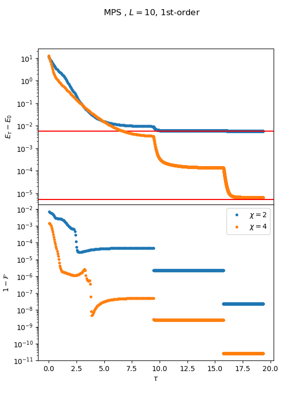
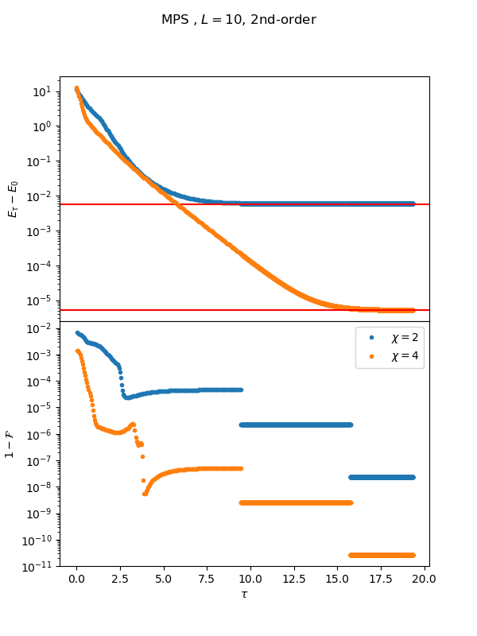
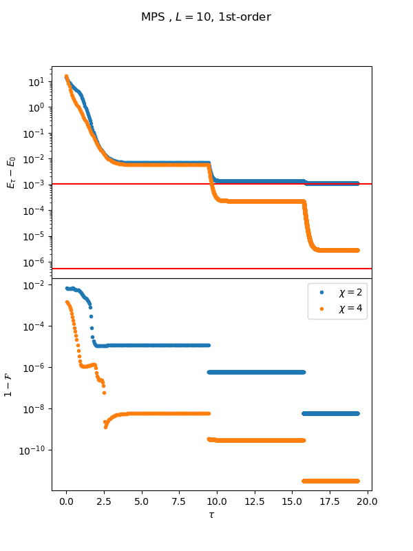
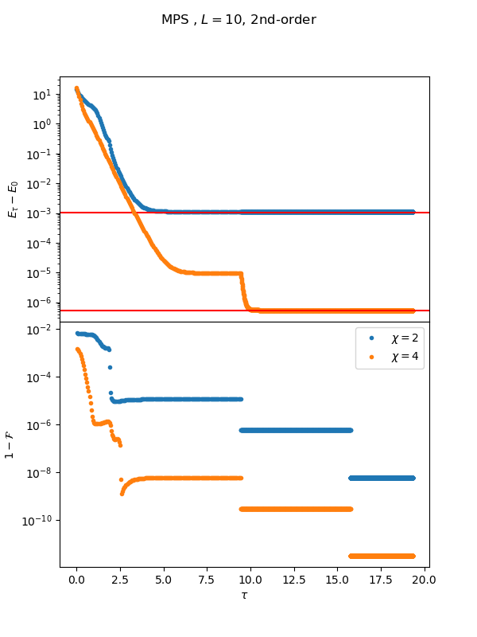
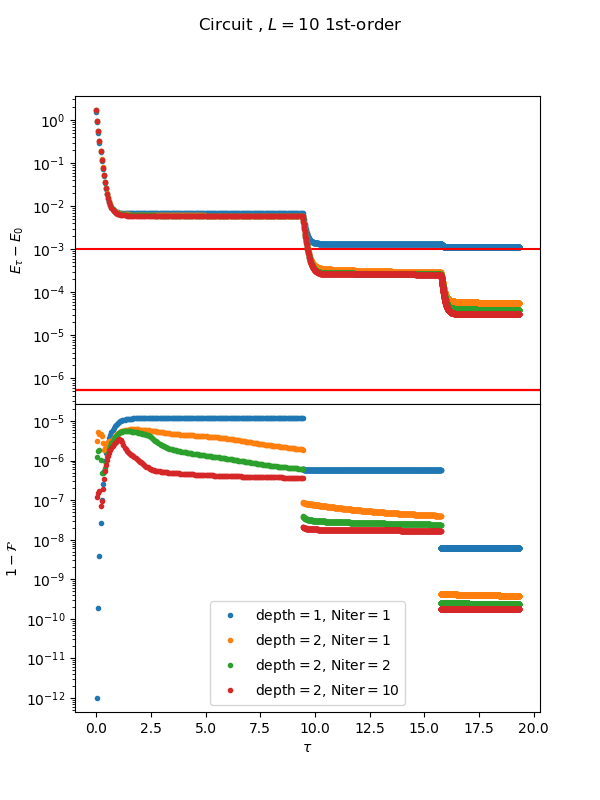
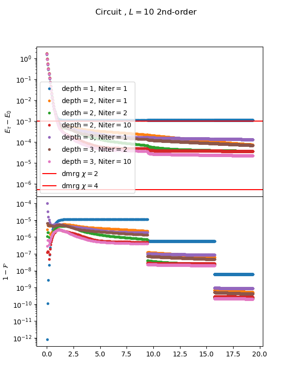

# qTEBD

## qTEBD with MPS

The red line indicate the DMRG result. qTEBD with MPS match with DMRG with same bond dimension exactly when 2nd-order trotter gate is applied.
 
#### g = 1.1
L 10 1st order trotter       |  L 10 2nd order trotter
:---------------------------:|:-------------------------:
   |  

#### g = 1.5
L 10 1st order trotter       |  L 10 2nd order trotter
:---------------------------:|:-------------------------:
   |  

## qTEBD with circuit

#### g = 1.1
#### g = 1.5
L 10 1st order trotter       |  L 10 2nd order trotter
:---------------------------:|:-------------------------:
   |  

### Single-layer circuit
### n-layer circuit

* There are different way to optimize n-layer circuit. Here we consider to randomly initialize 2-layer and optimize Niter time per time step.
* With near identity initialization and change Hamiltonian basis.

## TODO
* Iterative optimization for each layer. Optimize first layer and fix first layer. Then add second layer and optimize second layer and so on.
* Scaling with Niter
* The effect in the pattern of the layer of gates

