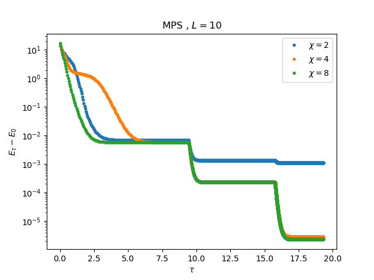
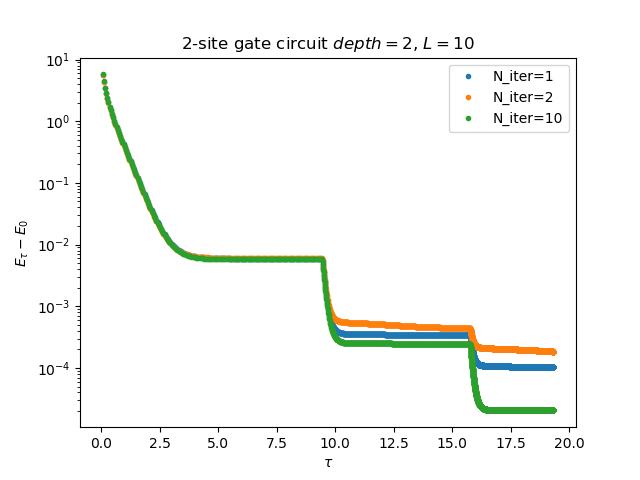

# qTEBD

## qTEBD with MPS
 

## qTEBD with circuit

### Single-layer circuit

### n-layer circuit

* There are different way to optimize n-layer circuit. Here we consider to randomly initialize 2-layer and optimize Niter time per time step.
 

* With near identity initialization and change Hamiltonian basis.

## TODO
* Iterative optimization for each layer. Optimize first layer and fix first layer. Then add second layer and optimize second layer and so on.
* Scaling with Niter
* The effect in the pattern of the layer of gates

