# qTEBD

qTEBD is the algorithm for real or imaginary time evolution by fidelity maximization. We benchmark such algorithm on MPS for ground state search and quench problem. Then, we show that the algorithm can be generalized to classical simulation of quantum circuit.

### Requirement

numpy, jax, (TeNPy)

## qTEBD with MPS

The red line indicate the DMRG result. qTEBD with MPS match with DMRG with same bond dimension exactly when 2nd-order trotter gate is applied.
 
### TFI g = 1.1
L 10 1st order trotter       |  L 10 2nd order trotter
:---------------------------:|:-------------------------:
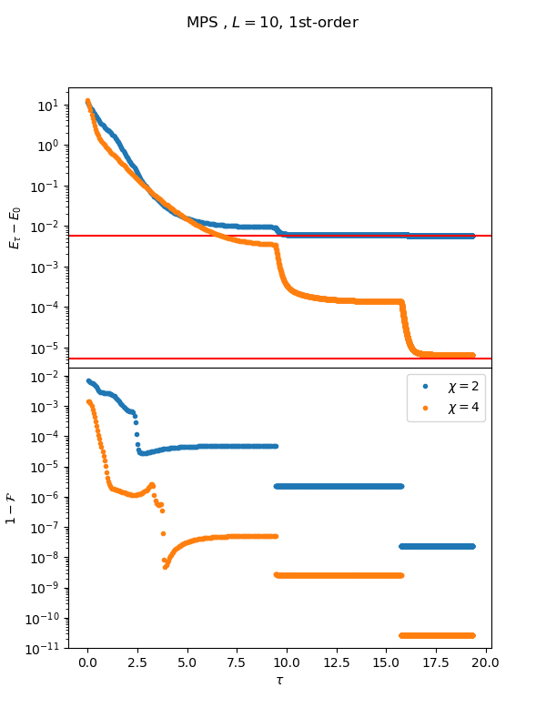   |  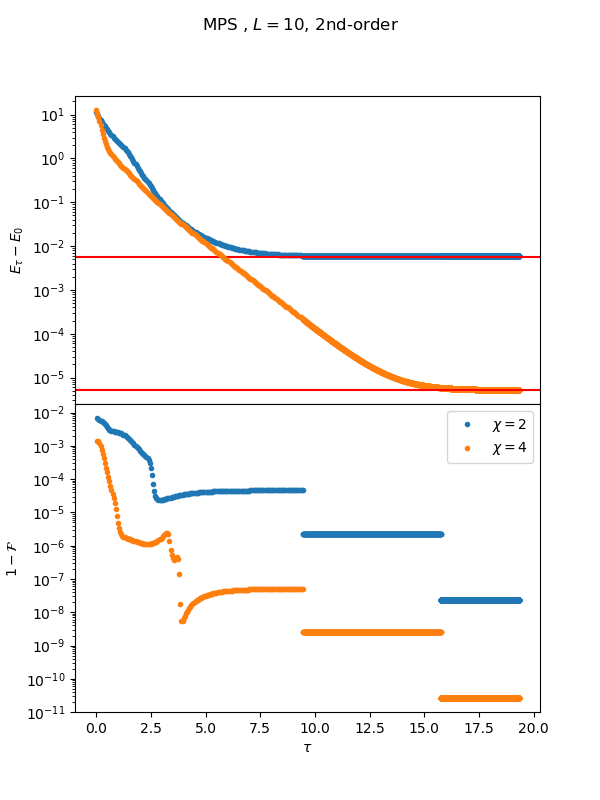

### TFI g = 1.5
L 10 1st order trotter       |  L 10 2nd order trotter
:---------------------------:|:-------------------------:
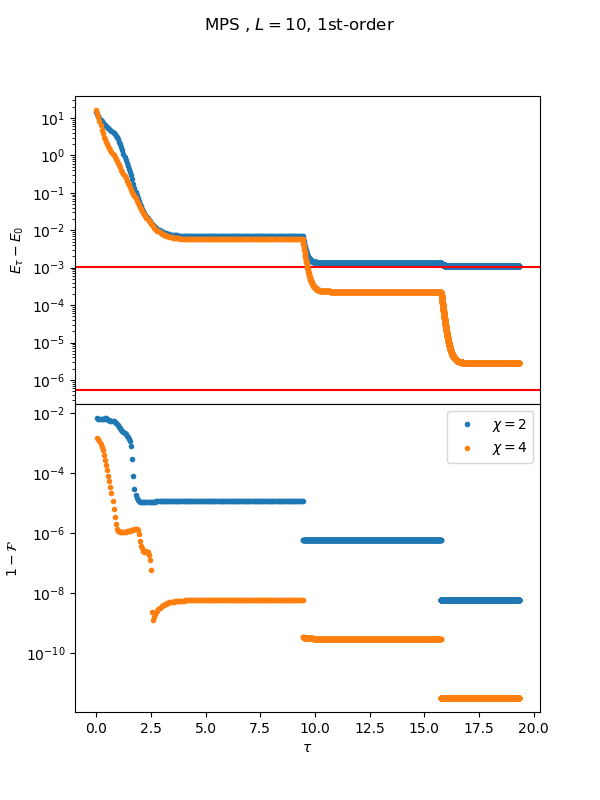   |  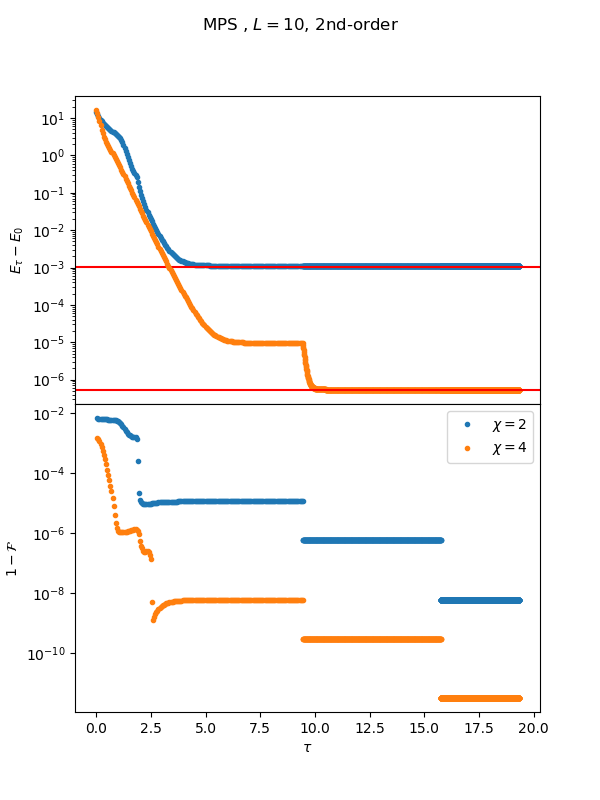

## qTEBD with circuit

We consider quantum circuit of 2-site gates, where the gates is arranged in the ladder form in each layer. Such n-layer circuit forms a subset of MPS of bond dimension 2^n. Contrary to the equivalence between MPS of bond dimension 2^n and quantum circuit of n-qubit gates, layers of 2-site gates could build up entanglement quickly with less parameters comparing to MPS. It is clear by parameter counting that n-layer circuit would have O(n) parameters while MPS of bond dimension 2^n has O(exp(n)) parameters. Thus, it can be thought of as a sparse representation, which is a subset of MPS with unknown variational power. 

### TFI g = 1.0
L 10 1st order trotter       |  L 10 2nd order trotter
:---------------------------:|:-------------------------:
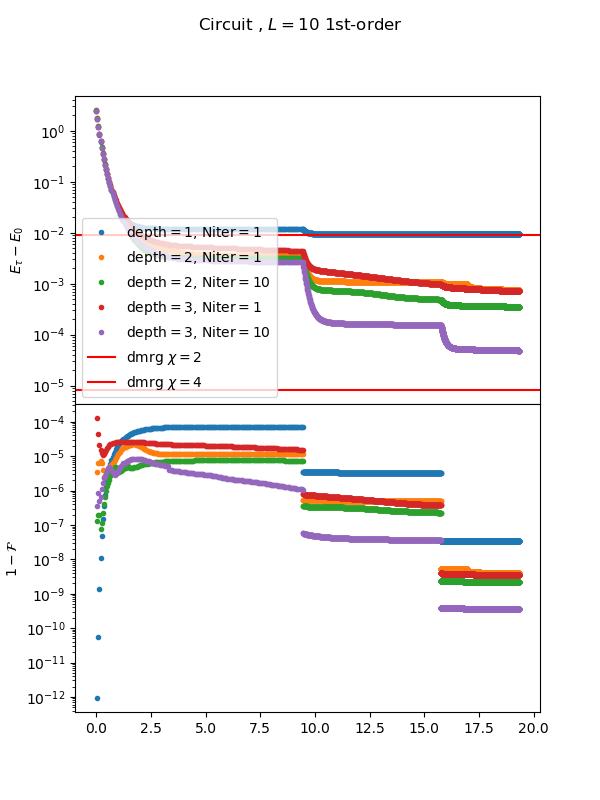   |  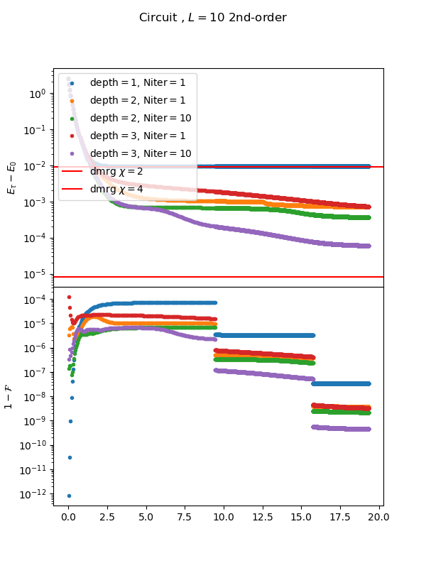

### TFI g = 1.5
L 10 1st order trotter       |  L 10 2nd order trotter
:---------------------------:|:-------------------------:
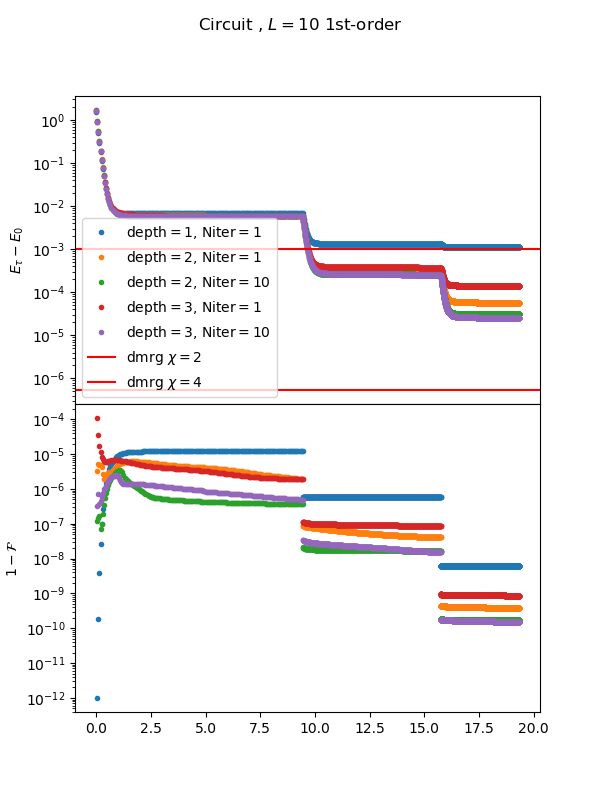   |  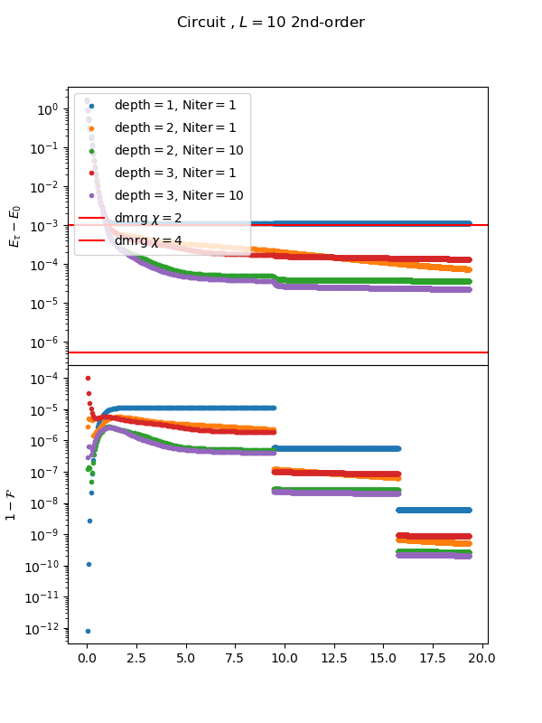

### XXZ Jz = 1.
L 10 1st order trotter       |  L 10 2nd order trotter
:---------------------------:|:-------------------------:
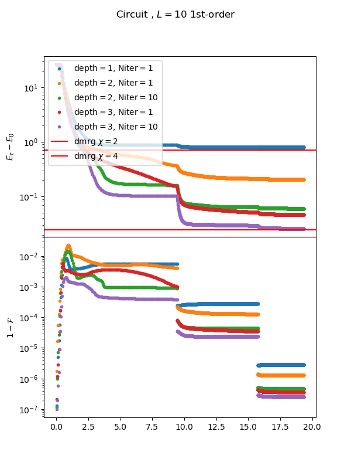   |  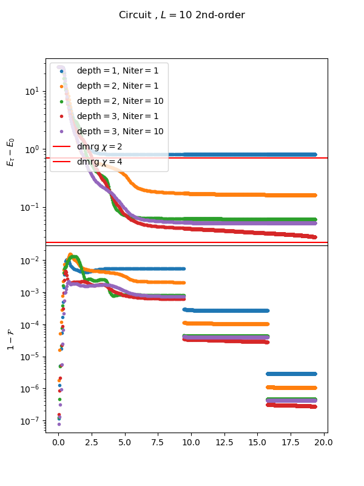
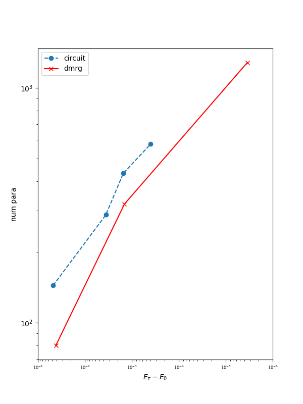   |  

## Quantum Quench
### TFI L = 31, g = 1.
MPS       |  Circuit
:---------------------------:|:-------------------------:
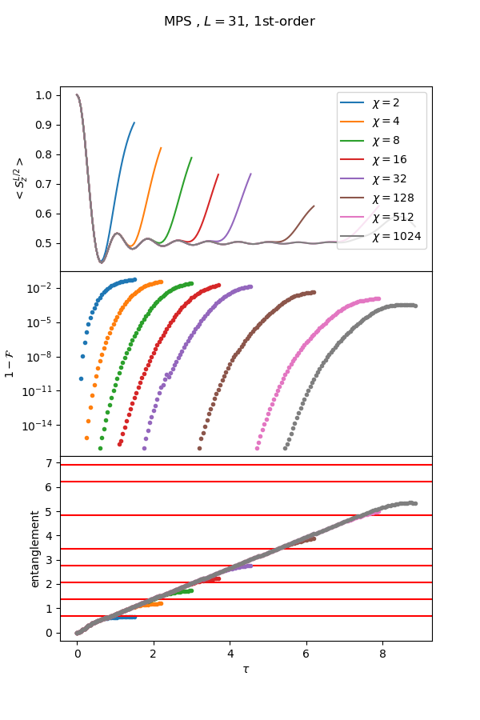  |  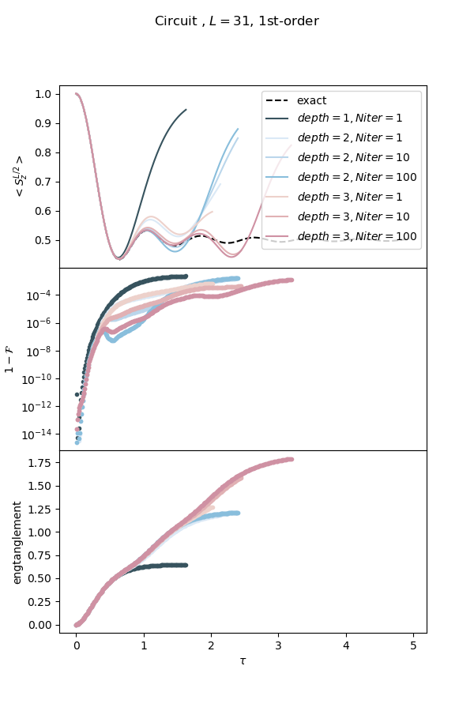

### Single-layer circuit

Single-layer circuit should match with the result of qTEBD with MPS and DMRG with MPS of bond dimension 2. Indeed we see that. Optimization for single-layer circuit is benign and could be easily solved with one iteration/sweep per time step.

### n-layer circuit

* There are different way to optimize n-layer circuit. Here we consider to randomly initialize n-layer and optimize Niter time per time step.
* With near identity initialization and change Hamiltonian basis.

## TODO
* plot num para v.s. accuracy
* MPS truncation for gate contraction; logging truncation error in gate contraction; rerun all data;
* Real time evolution; Global quench; 
* Scaling with Niter
* The effect in the pattern of the layer of gates

#### Note
* Does not seem to work : Iterative optimization for each layer. Optimize first layer and fix first layer. Then add second layer and optimize second layer and so on.
* Gradient descent for optimizing fedility of qTEBD-MPS gives very small improvement on top of polar decomposition. Gradient descent itself alone does not work.

* In time evolution, polar sweep along the isometry direction fails.

